  

### 🌀 [**ENTRA NELLA QUARTA DIMENSIONE →**](https://dimensione4.github.io)

Command deck interattivo · proiezione 4D in tempo reale · IT/EN

 

## Ciao, sono Dario 👋

Partner tecnologico per PMI e startup, founder di **[Dimensione 4](https://www.dimensione4.it)**, in provincia di Bergamo.

> **Aiuto le aziende a crescere con software e automazioni AI.**
> *La dimensione che manca alla tua attività.*

- 🎯 **Cosa costruisco:** software su misura · automazioni AI · piattaforme digitali · MVP SaaS (4-12 settimane) · siti orientati alla conversione
- 🔁 **Come lavoro:** metodo MCE (Mappa, Costruisci, Evolvi) · un unico responsabile · il codice resta al cliente
- 🧭 **Background:** ex Accenture, ~5 anni enterprise · recensioni 5.0 verificabili
- 📅 **Parliamone:** [prenota una call conoscitiva di 30 minuti](https://tidycal.com/dimensione-4-di-dariomarcobellini/meeting-conoscitivo-30min) · preventivo in 48h

 

## 🧰 Stack

**Frontend**

**Backend & Dati**

**CMS & E-commerce**

**DevOps & Automazioni**

 

## 📊 Statistiche

  

 

## 🚀 Progetti

### In evidenza

| Progetto | Descrizione | Stack |
|---|---|---|
| 🧠 **Company Brain** · *in sviluppo* | Knowledge graph 3D dell'azienda, esplorabile in VR (Meta Quest), con wiki collegata a Obsidian | `3d-force-graph` `WebXR` `Obsidian` |
| 🌀 **Command Deck** | Questa pagina profilo e la dashboard 4D interattiva | `Three.js` `GLSL` |
| 🌐 **dimensione4.it** | Il mio sito, orientato alla conversione | `Next.js` `GSAP` |

### 🔒 Per i clienti (codice privato)

Il grosso del mio lavoro vive in repository private. Qualche esempio di cosa c'è dietro le quinte:

- **CRM aziendale con automazioni** · pipeline di vendita automatizzata con n8n e notifiche Telegram
- **Piattaforma fiscale** · gestione dell'attività, self-hosted
- **Piattaforma di ticketing** · gestione richieste e assistenza, in ottimizzazione continua
- **WhatsApp Lead Agent** · agente AI che qualifica i lead 24/7 dalle campagne ads

> Case study e dettagli su [dimensione4.it](https://www.dimensione4.it), o [parliamone in call](https://tidycal.com/dimensione-4-di-dariomarcobellini/meeting-conoscitivo-30min).

 

## 🐍 Contribuzioni

<picture>
  <source media="(prefers-color-scheme: dark)" srcset="https://raw.githubusercontent.com/Dimensione4/Dimensione4/output/github-snake-dark.svg"/>
  <source media="(prefers-color-scheme: light)" srcset="https://raw.githubusercontent.com/Dimensione4/Dimensione4/output/github-snake.svg"/>
  
</picture>

 

## 🔗 Contatti

 

